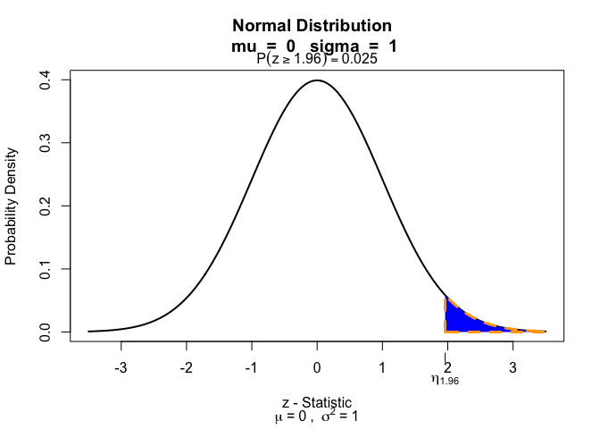
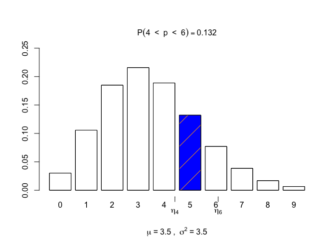
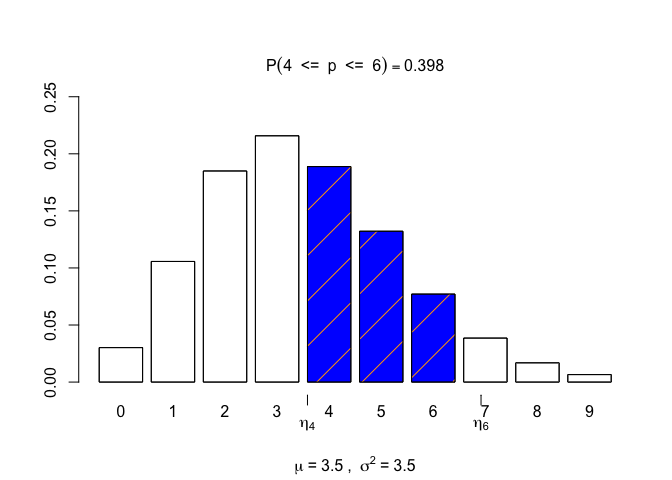

<!-- README.md is generated from README.Rmd. Please edit that file -->

# visualize

<!-- badges: start -->

[](https://github.com/coatless-rpkg/visualize/actions/workflows/R-CMD-check.yaml)
[](https://www.r-pkg.org/pkg/visualize)
[](https://CRAN.R-project.org/package=visualize)
<!-- badges: end -->

The goal of visualize is to graph the pdf or pmf and highlight what area
or probability is present in user defined locations. Visualize is able
to provide lower tail, bounded, upper tail, and two tail calculations.
Supports strict and equal to inequalities. Also provided on the graph is
the mean and variance of the distribution.

## Installation

You can install the released version of visualize from
[CRAN](https://CRAN.R-project.org) with:

``` r
install.packages("visualize")
```

And the development version from [GitHub](https://github.com/) with:

``` r
# install.packages("devtools")
devtools::install_github("coatless/visualize")
```

## Examples

To use visualize, load the package with:

``` r
library("visualize")
```

Then, construct a graph by following the `visualize.dist()` pattern. For
example, the normal distribution can be shown with:

``` r
# Graph a standard normal distribution with a z-score of 1.96
visualize.norm(1.96)
```


``` r
# Change the location of the tail
visualize.norm(1.96, section = "upper")
```



``` r
# Create a bounded range.
visualize.norm(c(-1.96, 1.96), section = "bounded")
```


``` r
# Highlight both tails
visualize.norm(c(-1.96, 1.96), section = "tails")
```


The parameters of the distribution can also be modified. Take for
example the Binomial distribution.

``` r
visualize.binom(stat = 9, size = 20, p = 0.5)
```


``` r
# Visualize the binominal distribution with a higher size and lower probability.
visualize.binom(stat = 9, size = 24, p = 0.25)
```


Discrete distributions can also handle a level of strict (`<`, `>`) or
equal to (`<=`, `>=`) inequality.

``` r
# Create a strict inequality (lower < x < higher)
visualize.pois(stat = c(4, 6), lambda = 3.5, section = "bounded",
  strict = c(TRUE, TRUE))
```



``` r
# Allow for equality on either side only on the right side of the bounded region.
visualize.pois(stat = c(4, 6), lambda = 3.5, section = "bounded",
  strict = c(TRUE, FALSE))
```


``` r
# Allow for equality on either side of the inequality (lower <= x <= higher)
visualize.pois(stat = c(4, 6), lambda = 3.5, section = "bounded",
  strict = c(FALSE, FALSE))
```



## Author

James Joseph Balamuta

## Citing the `visualize` package

To ensure future development of the package, please cite `visualize`
package if used during an analysis or simulation study. Citation
information for the package may be acquired by using in *R*:

``` r
citation("visualize")
```

## License

MIT License
